Trần Tuấn Phong - 23810310316

Mô tả chức năng: 
-Xác thực người dùng
-Khám phá sản phẩm
-Giỏ hàng
-Đặt hàng
-Lịch sử đơn hàng
-Yêu thích
-Tài khoản

Cách chạy: chạy lệnh 'npm start' ở git bash

Lưu ý: ứng dụng đưuọc thiết kế để màn hình lỗi đặt hàng chỉ hiện ra chỉ khi có đúng 3 sản phẩm

Câu hỏi:

1.AsyncStorage là một hệ thống lưu trữ key-value trên thiết bị, hoạt động bất đồng bộ (async). Dữ liệu được ghi vào bộ nhớ cục bộ của điện thoại, tồn tại ngay cả khi tắt app.

2.State (useState) chỉ sống trong bộ nhớ RAM, tắt app là mất. AsyncStorage ghi ra đĩa nên dữ liệu tồn tại lâu dài.

3.So sánh AsyncStorage vs Context API
| Tiêu chí       | AsyncStorage | Context API   |
| -------------- | ------------ | ------------- |
| Lưu lâu dài    |  Có          |    Không      |
| Bất đồng bộ    |  Có          |    Không      |
| Dùng để        | Lưu dữ liệu  | Quản lý state |
| Tốc độ         | Chậm hơn     |    Nhanh      |
| Mất khi reload |  Không       |     Có        |

Video Demo:
[▶️ Watch Demo](https://raw.githubusercontent.com/pHong1807/th3/main/demo/demo.mp4)

Hình ảnh:
Splashcreen:

Onbordingscreen:

SignInscreen:

Phonenumberscreen:

Verificationscreen:

Locationscreen:

Loginscreen:

Signupscreen:

Shopcreens:
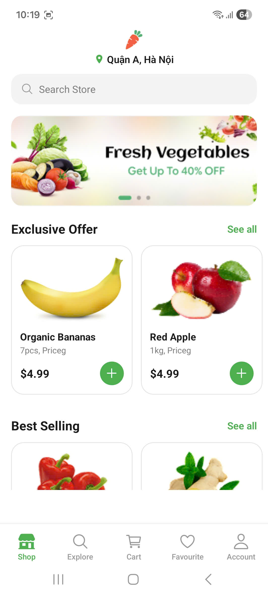
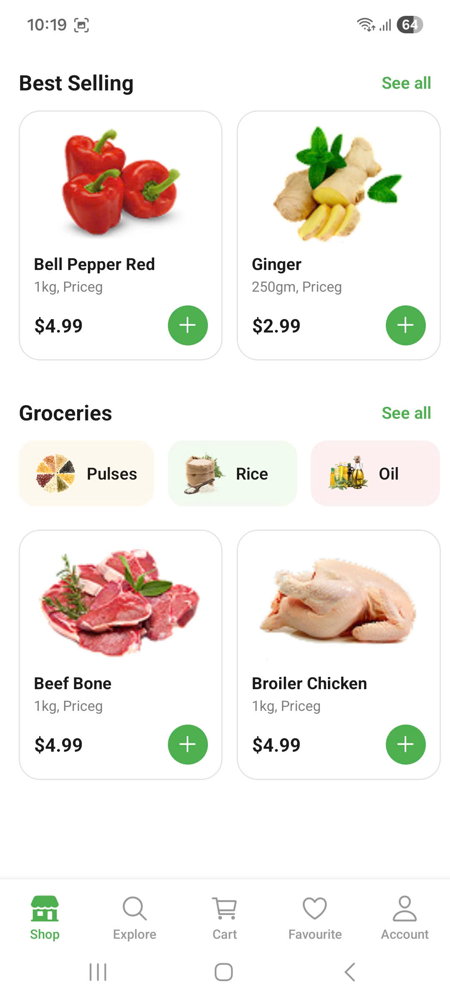
Productdetailscreen:
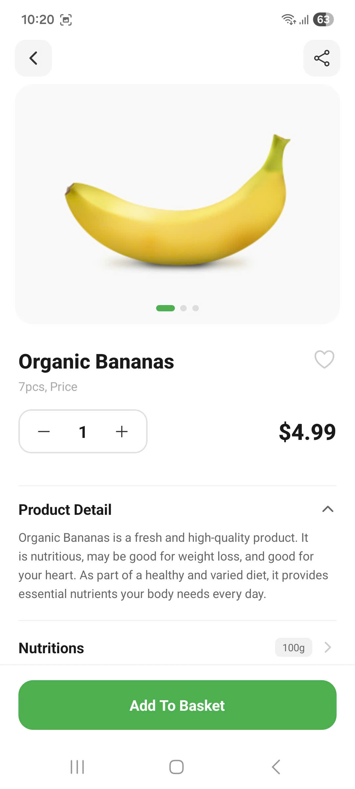
Searchscreen:
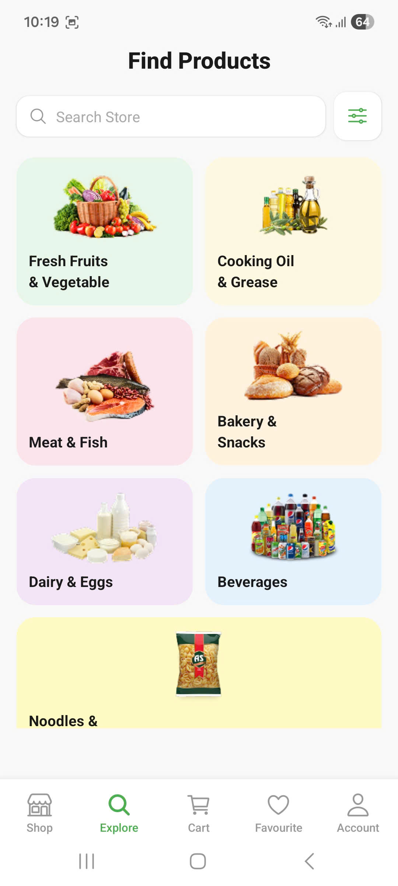
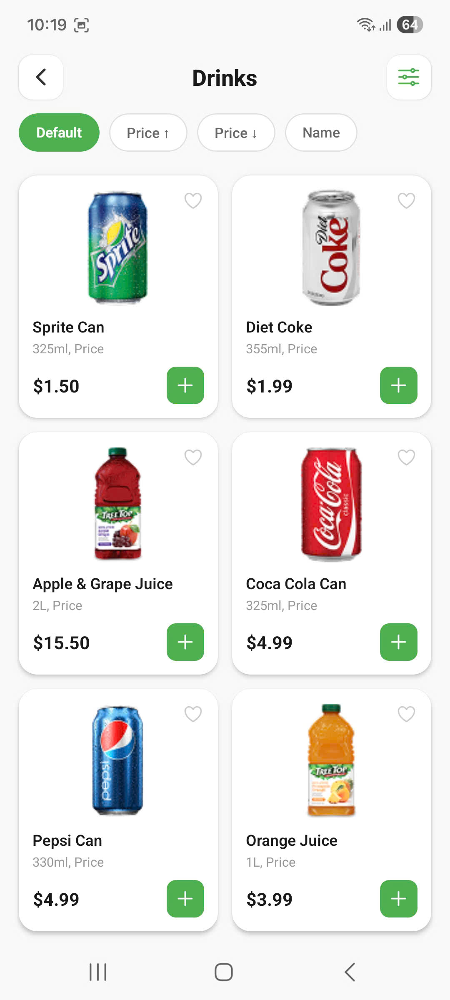
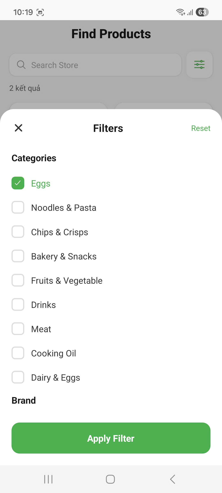
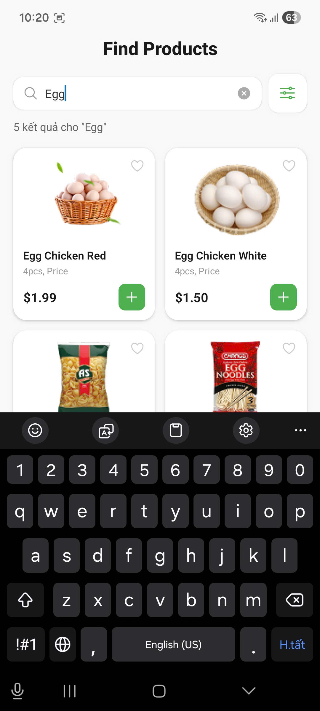
Cartscreen:
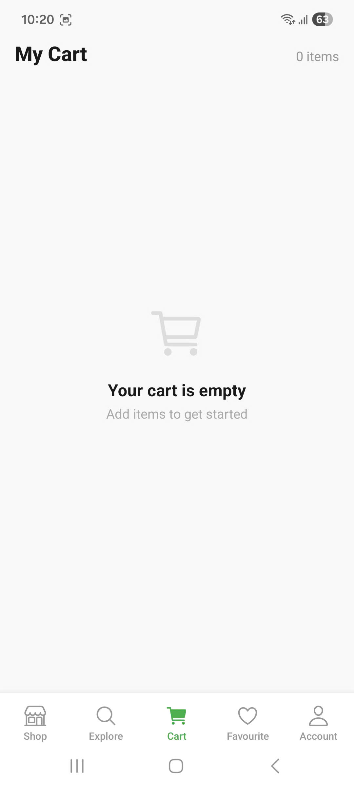
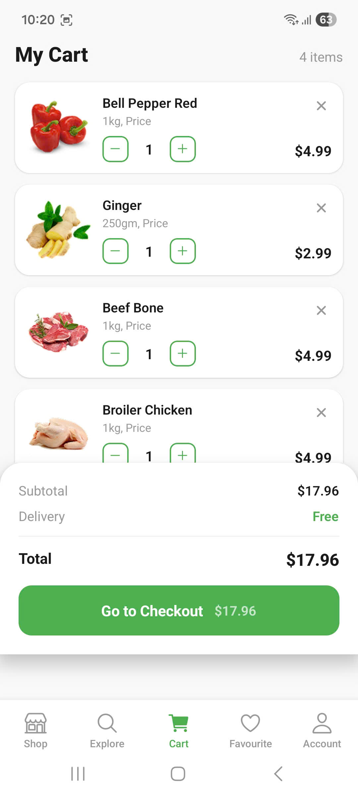
Checkoutscreen:
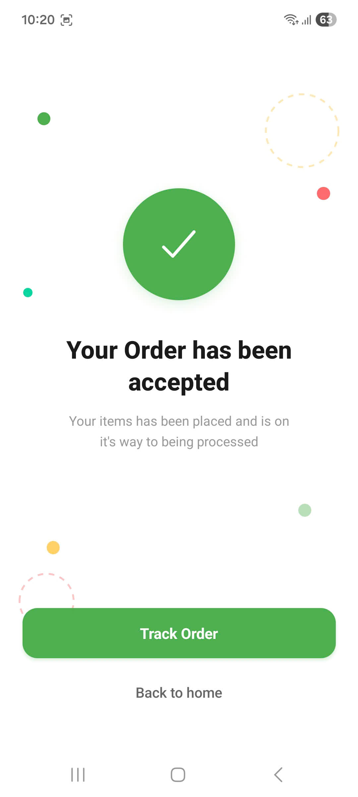
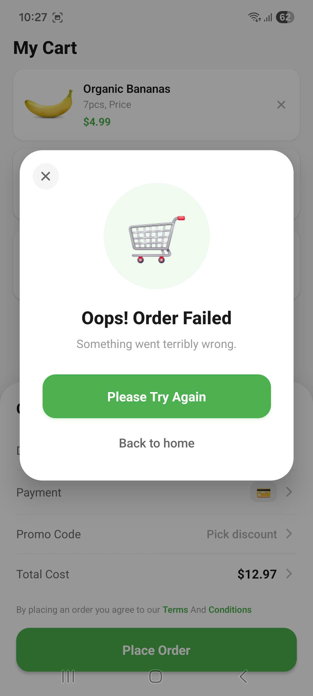
Favouritescreen:
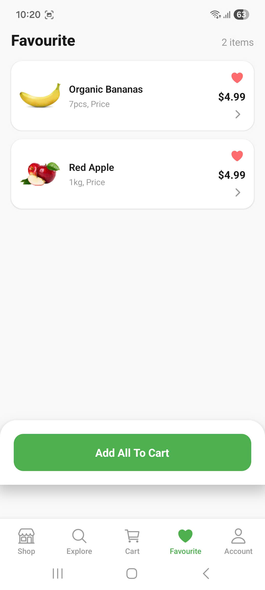
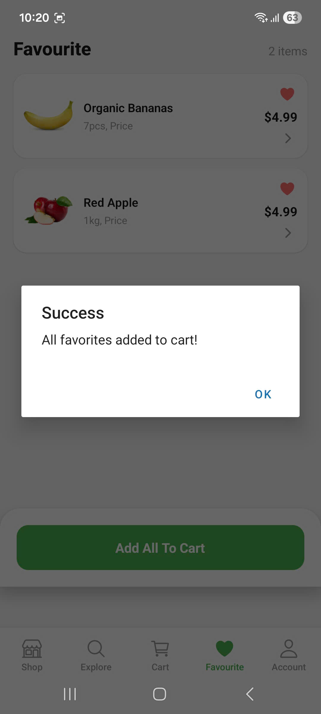
Accountscreen:
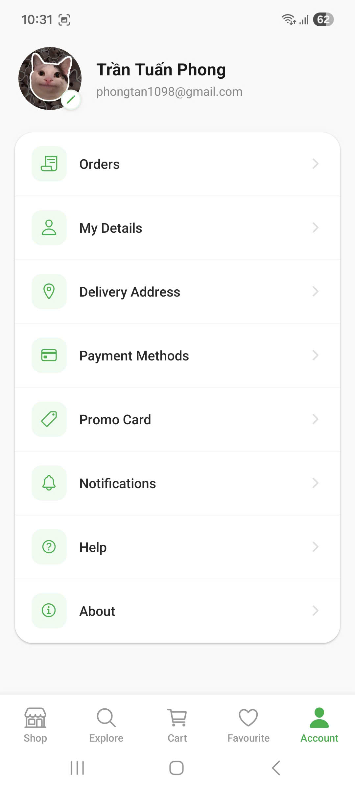
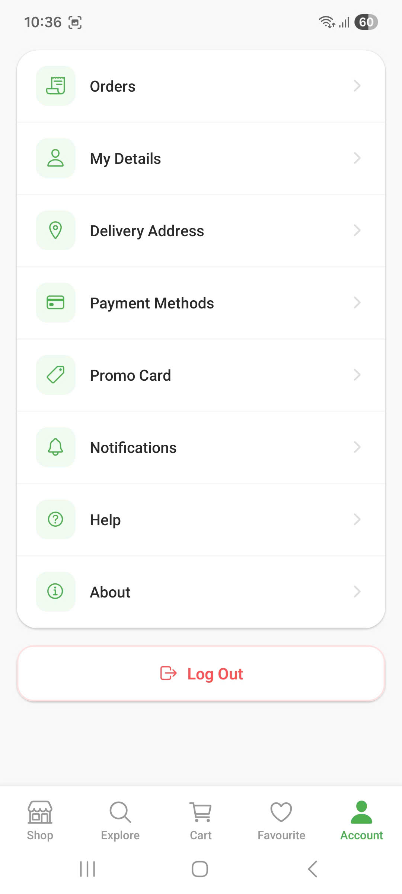
Orderscreen:
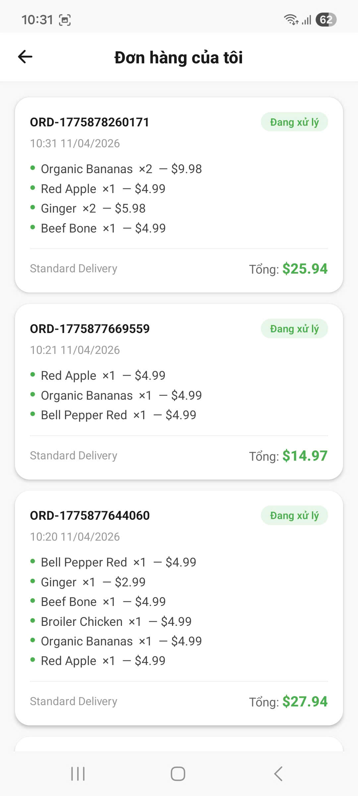

